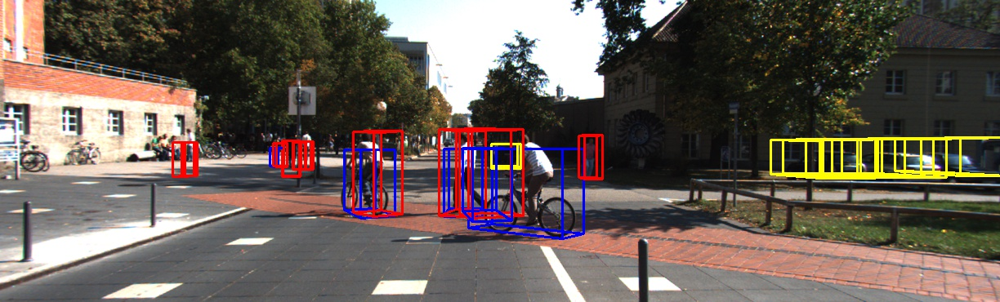
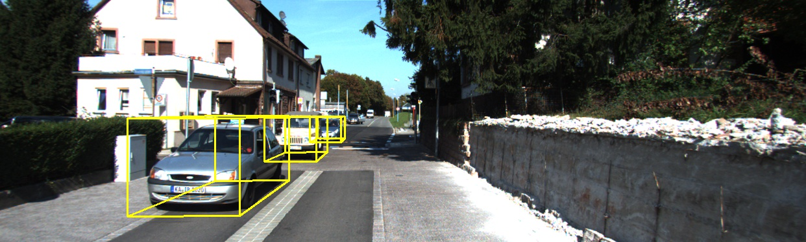
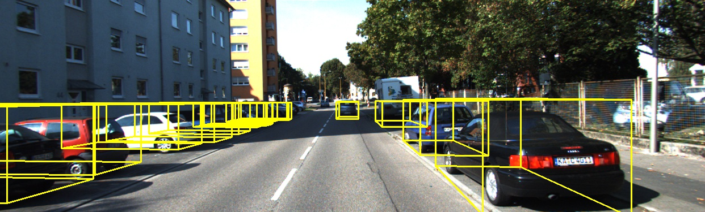
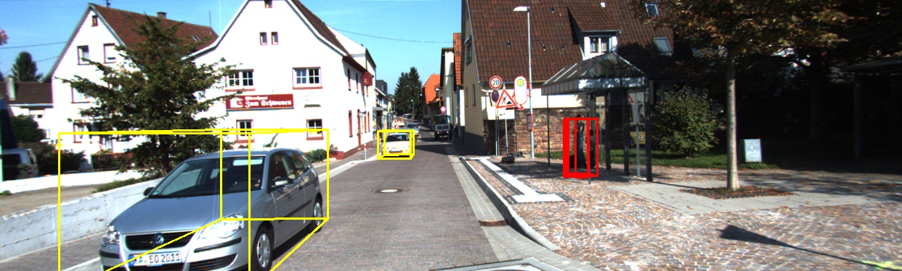

# Complex-YOLO-V3
Complete PyTorch Implementation of my thesis "Single-stage object detection for 3D point clouds". This code is developed on the baseline [Complex-YOLO: Real-time 3D Object Detection on Point Clouds](https://arxiv.org/pdf/1803.06199.pdf). The original paper was an extension of YOLOv2 whereas for the thesis, Complex-YOLO is extended on YOLOv3.

As a part of my thesis, I developed 14 different models and compared their performances on the original KITTI dataset. The models were developed by modifying the feature extraction layers of the network as well as the layers in the YOLO network. The modifications are influenced by depthwise separable convolutions, MobileNet and PeleeNet.

The architectures can broadly be classified into 5 categories :

1. complex_yolov3   : Complex-YOLO extended on YOLOv3.
2. dep_sep		    : The 3x3 convolution layers are replaced with 3x3 depthwise separable convolution layers.
3. mobile_v1_yolov3 : MobileNet v1 is used as a feature extractor for the model. The subsequent versions involve hyper-parameter tuning.
4. mobile_v2_yolov3 : MobileNet v2 is used as a feature extractor for the model. The subsequent versions involve hyper-parameter tuning.
5. pelee_v1_yolov3 : PeleeNet is used as a feature extractor for the model. The subsequent versions involve hyper-parameter tuning.

## Installation
#### Clone the project and install requirements
    $ git clone https://github.com/cadip92/Complex-YOLOv3
    $ cd Complex-YOLO-V3/
    $ conda <env_name> create -f environment.yml

## Data Preparation

You can see `sampledata` folder in `data/KITTI/dataset` directory which can be used for testing this project without downloading KITTI dataset. However, if you want to train the model by yourself and check the mAP in validation set just follow the steps below.

#### Download the [3D KITTI detection dataset](http://www.cvlibs.net/datasets/kitti/eval_object.php?obj_benchmark=3d) 
1. Camera calibration matrices of object data set (16 MB)
2. Training labels of object data set (5 MB)
3. Velodyne point clouds (29 GB)
4. Left color images of object data set (12 GB)

Now you have to manage dataset directory structure. Place your dataset into `data` folder. Please make sure that you have the dataset directory structure as follows. 

```
└── data/KITTI/object
       ├── training    <-- 7481 train data
       |   ├── image_2 <-- for visualization
       |   ├── calib
       |   ├── label_2
       |   ├── velodyne
       └── testing     <-- 7580 test data
           ├── image_2 <-- for visualization
           ├── calib
           ├── velodyne           
```

The `train/valid` split of training dataset as well as `sample` and `test` dataset ids are in `data/KITTI/ImageSets` directory. From training set of 7481 images, 6000 images are used for training and remaining 1481 images are used for validation. The mAP results reported in this project are evaluated into this valid set with custom mAP evaluation script with 0.5 iou for each object class. 

## Train

Modify the "model_def" and "checkpoint_file" in the config.json file before execution. For e.g. "config/complex_yolov3.cfg" is the model configuration file for Complex YOLO v3. The config files are available in the 'config' directory. The checkpoints for previously trained models are available in the 'checkpoints' file.

    $ python train.py --config config.json

--Training log example--

    ---- [Epoch 0/150, Batch 250/1441] ----  
    +------------+--------------+--------------+--------------+  
    | Metrics    | YOLO Layer 0 | YOLO Layer 1 | YOLO Layer 2 |  
    +------------+--------------+--------------+--------------+  
    | grid_size  | 17           | 34           | 68           |  
    | loss       | 6.952686     | 5.046788     | 4.256296     |  
    | x          | 0.054503     | 0.047048     | 0.060234     |  
    | y          | 0.110871     | 0.059848     | 0.081368     |
    | w          | 0.101059     | 0.056696     | 0.022349     |
    | h          | 0.294365     | 0.230845     | 0.076873     |
    | im         | 0.215230     | 0.218564     | 0.184226     |
    | re         | 1.049812     | 0.883522     | 0.783887     |
    | conf       | 4.682138     | 3.265709     | 2.941420     |
    | cls        | 0.444707     | 0.284557     | 0.105938     |
    | cls_acc    | 67.74%       | 83.87%       | 96.77%       |
    | recall50   | 0.000000     | 0.129032     | 0.322581     |
    | recall75   | 0.000000     | 0.032258     | 0.032258     |
    | precision  | 0.000000     | 0.285714     | 0.133333     |
    | conf_obj   | 0.058708     | 0.248192     | 0.347815     |
    | conf_noobj | 0.014188     | 0.007680     | 0.010709     |
    +------------+--------------+--------------+--------------+
    Total loss 16.255769729614258
    ---- ETA 0:18:27.490254

## Evaluation
    $ python eval_mAP.py --config config.json
	
All the evaluation results are presented after training the models for 150 epochs.

Please refer 'eval_results_combined.xlsx' for the full evaluation results.

#### Test the model on sample dataset

    1. Update the 'model_def' in config.json file to the model that needs to be tested(provided in 'config' directory)
	2. $ python test_detection.py --config=config.json

#### Results 
<p align="center"></p>
<p align="center"></p>
<p align="center"></p>
<p align="center"></p>

## Credit

1. Complex-YOLO: https://arxiv.org/pdf/1803.06199.pdf

The Complex-YOLOv3 repo was forked from:
1. https://github.com/ghimiredhikura/Complex-YOLOv3
